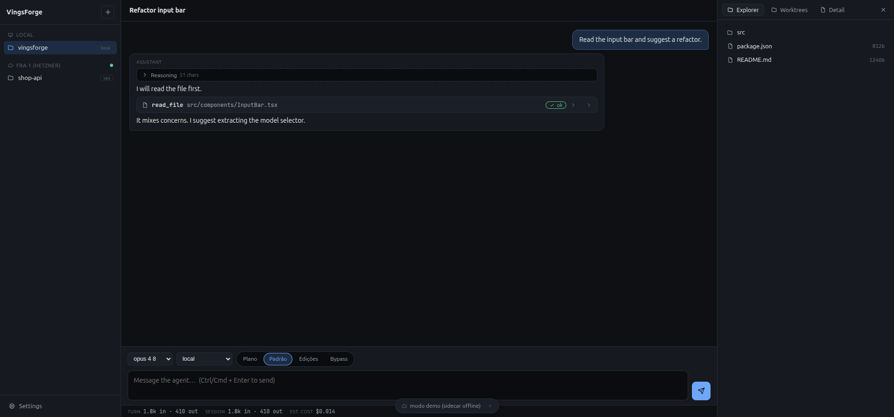
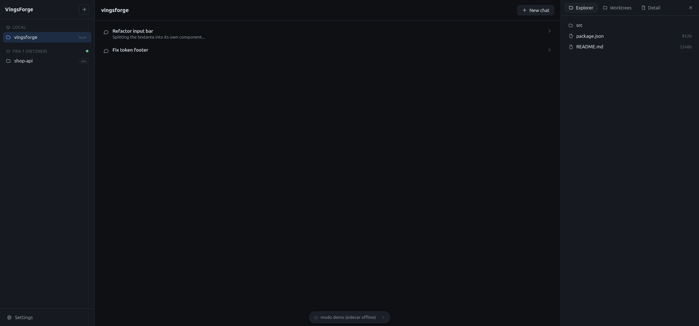
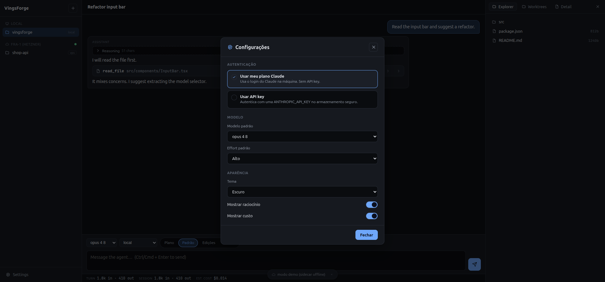
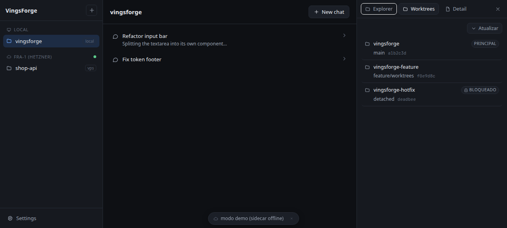

# VingsForge

App desktop **Linux-first** (Tauri 2 + sidecar Node + React) que usa a **Claude como motor** de um coding agent — no estilo OpenCovibe / Nimbalyst. Projetos são pastas no disco; cada projeto contém chats. O motor usa **o login do `claude` CLI já instalado na máquina** (sua assinatura Pro/Max, sem API key) ou uma API key.



## Features

- **Motor real pela sua assinatura** — usa o login do `claude` CLI da máquina (`apiKeySource: none`); API key é opcional.
- **Projetos = pastas** com seletor de pasta nativo; vários **chats** por projeto, persistidos.
- **Streaming** de resposta, painel de **raciocínio** colapsável, **cartões de ferramenta** (read/edit/bash) com estado.
- **Modos de permissão**: `Plano` (só lê/planeja) · `Padrão` · `Edições` (auto-aprova edições) · `Bypass` (aprova tudo) — mapeados pro `--permission-mode` do Claude.
- **Explorer** de arquivos do workspace e aba **Detail** (diff/saída de uma tool).
- **Worktrees** — aba que lista os git worktrees do projeto (branch, HEAD, principal/locked).
- **Configurações**: modo de auth (plano/key), modelo padrão, effort, tema dark/light, mostrar raciocínio/custo.
- **Runtime remoto (VPS)** — infra de daemon headless via SSH + WebSocket (Spec 05).
- **Segurança**: WS só em `127.0.0.1` com token por-sessão; chave de API no keyring (libsecret), nunca em arquivo/log; tools confinadas à raiz do workspace.
- **Linux-first (Omarchy / Arch + Hyprland)**: empacotado como AppImage distro-agnóstico; tema escuro nativo; sem emoji na UI.

## Screenshots

| Conversa + modos | Configurações | Worktrees |
|---|---|---|
|  |  |  |

## Como funciona

```
WebView (React) ──ws://127.0.0.1:8731──▶ sidecar Node (host)
                                            ├─ spawna `claude` CLI (stream-json) = sua assinatura
                                            ├─ SQLite (projetos/chats) + tools confinadas ao workspace
                                            └─ mesmo protocolo p/ runtime remoto (daemon na VPS via SSH)
```

O shell Tauri (Rust) só sobe e supervisiona o sidecar e injeta um token de auth por-sessão na WebView. O motor é o `claude` CLI — então funciona com **sua assinatura** (login da máquina) ou uma API key.

## Stack

- **Shell:** Tauri 2 (Rust + WebKitGTK)
- **Motor:** sidecar Node (`@vingsforge/sidecar`) → `claude` CLI em stream-json
- **UI:** React + Vite + TypeScript
- **Persistência:** SQLite (better-sqlite3) + arquivos no disco (XDG)
- Monorepo pnpm: `packages/shared | sidecar | ui`, `apps/desktop`

## Requisitos (Omarchy / Arch)

- Node 20+, pnpm
- Rust + toolchain Tauri. No Arch/Omarchy:
  `sudo pacman -S --needed base-devel rust webkit2gtk-4.1 gtk3 libappindicator-gtk3 librsvg`
- **Claude Code CLI** logado (`claude` no PATH) — para o modo plano
- `libsecret` (fornece o `secret-tool`): `sudo pacman -S --needed libsecret` — apenas para o modo API key

> **Hyprland (Wayland):** o WebKitGTK costuma abrir uma janela branca sob compositores Wayland. O app já força `WEBKIT_DISABLE_DMABUF_RENDERER=1` / `WEBKIT_DISABLE_COMPOSITING_MODE=1` no `main.rs` (e no `.desktop` instalado), então não é preciso exportar nada à mão.

## Dev

```sh
pnpm install
pnpm build   # compila shared, persistence, sidecar e ui em ordem
cd apps/desktop && pnpm tauri dev
```

## Build (AppImage)

```sh
# empacota o sidecar self-contained nos resources e gera o bundle
pnpm build   # compila shared, persistence, sidecar e ui em ordem
pnpm --filter @vingsforge/sidecar deploy --prod --legacy --node-linker=hoisted /tmp/sidecar-hoisted
cp -r /tmp/sidecar-hoisted apps/desktop/src-tauri/sidecar && rm -rf apps/desktop/src-tauri/sidecar/node_modules/.bin
cd apps/desktop && pnpm tauri build
# artefato em apps/desktop/src-tauri/target/release/bundle/appimage/
```

> O `node` e o `claude` continuam vindo da máquina; o sidecar (incl. `better-sqlite3` nativo) é compilado contra o Node local — para distribuir a outras máquinas, o ABI do Node precisa bater.

Specs detalhadas em [`docs/specs/`](docs/specs/).
